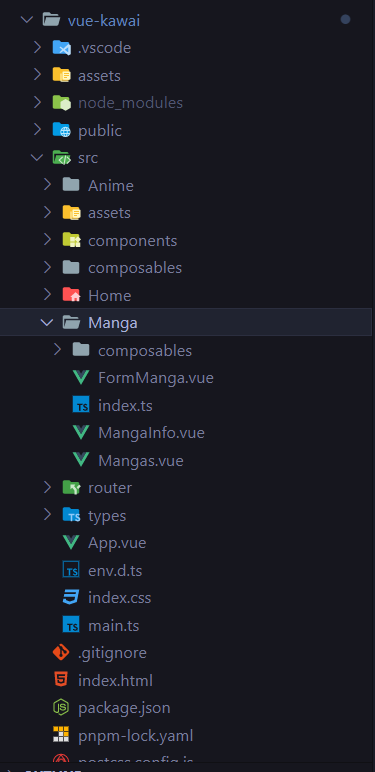
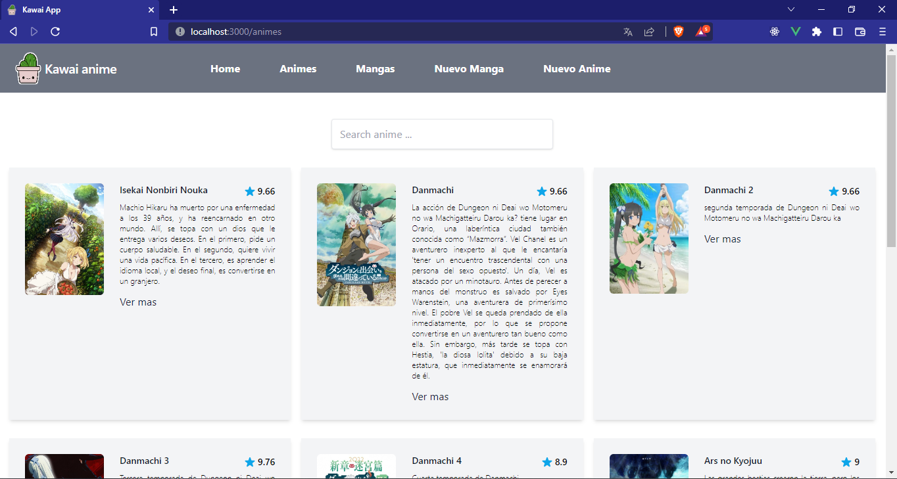
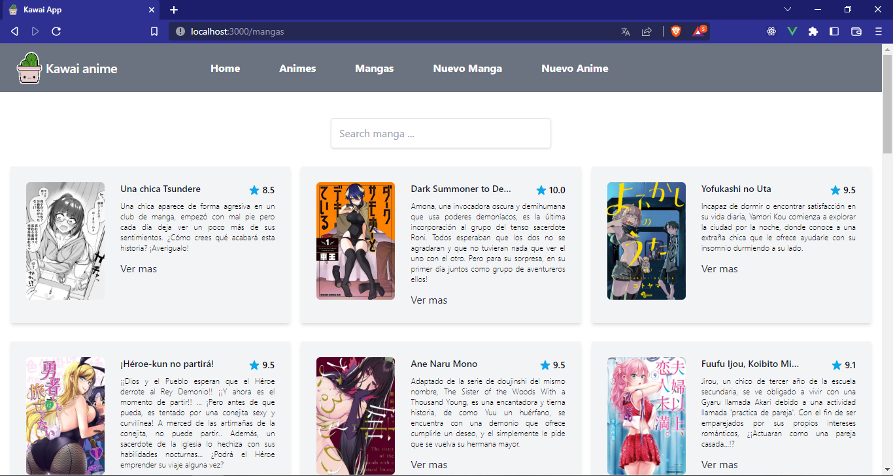
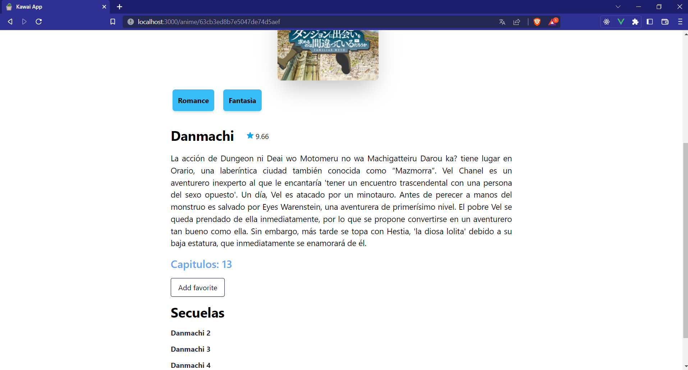
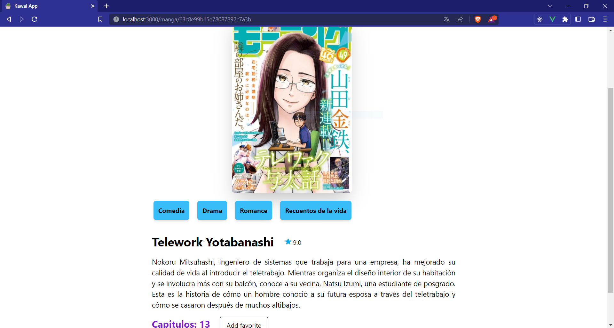
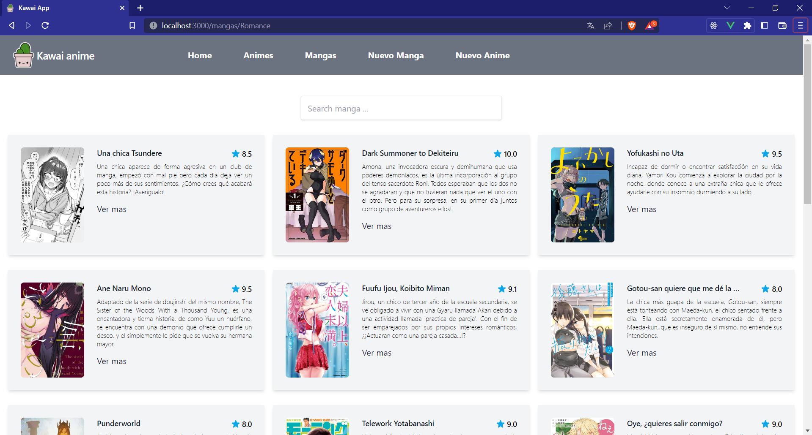

# Kawai App (Vue 3 + Typescript + Vite)

## En que consiste ls aplicacion
Es una aplicacion donde se pueden ver mangas y animes  se puede ver los detalles del mismo en el caso
de loa animes se pueden ver las secuelas o precuelas del mismo.

para estilar este proyecto se utiliza [Tailwind](https://tailwindcss.com/) y para consumir el backend grapqhl se utiliza [villus](https://villus.logaretm.com/) el cual es mas ligero y rapido que el cliente apollo pero depende de sus preferencias.

## Que hay de nuevo
se ha refactorizado el orden de carpetas siguiendo la clean architecture donde cada componente de la aplicacion tiene su carpeta donde contiene componentes internos , estados en el caso de vue composables.
componenres mas reutilizables y agnosticos que se pueden utilizar tanto para anime como manga. se cambio  npm a [pnpm](https://pnpm.io/es/) como manejador de paquetes mas que nada por perfomance y pruebas a este manejador de paquetes.

## Estructuras de carpteas 
cada componente de la aplicacion es representado por una carpeta las carpetas comunes como types y composables , components son  elementos que se pueden utilizar en varias partes de la aplicacion puedes observar un ejemplo en la siguiente imagen.




### ventajas de la estructura de carpetas
cada parte de la aplicacion queda encapsulada en un solo lado asi es mas facil cambiar o detectar fallas ya que toda la logica de un componente de la aplicacion esta en un solo lado y no puede afectar facilmente a los otros componentes.

## Capturas

### Lista de animes y mangas

listado donde se pueden ver los animes y mangas que han sido guardados en la base de datos estos se muestran en forma de tarjetas y muentran una link para ver mas informacion.





### Detalles de anime y manga

apartado donde puedes ver un anime o manga a detalle se puede dar click en el boton de algun genero para mostrar una lista de acuerdo al genero que se le ha dado click





## Lista por generos de animes y mangas 
al dar click en alguno de los generos se redirecciona a una lista de animes y mangas filtrados por el genero seleccionado 




## Nuevo anime y manga
ambos formularios son el mismo componente solo que en animes nos permite seleccionar los nombres de las secuelas y precuelas.


## Home 
muestra los favoritos seleccionados con anterioridad en detalles tambien permite borrarlos de favoritos


## Iniciar servidor de desarrollo 
una vez clonado el proyecto ejecuta 

``` node 
 pnpm -i o npm -i
 ```

enseguida ejecuta 

``` node 
 pnpm run dev o npm run dev
 ``` 


