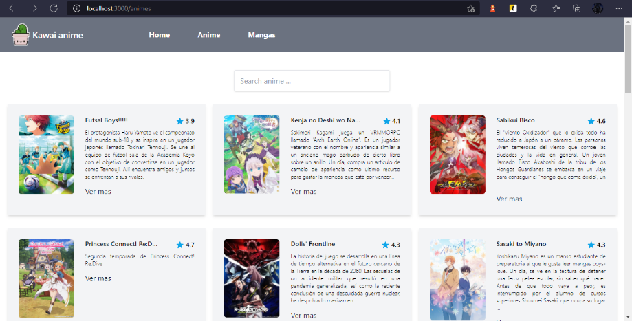
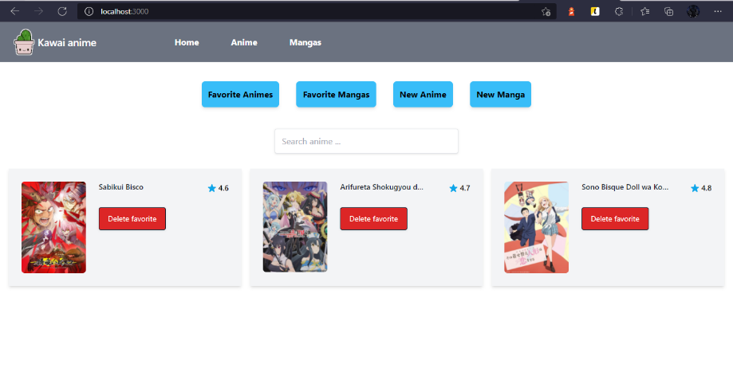
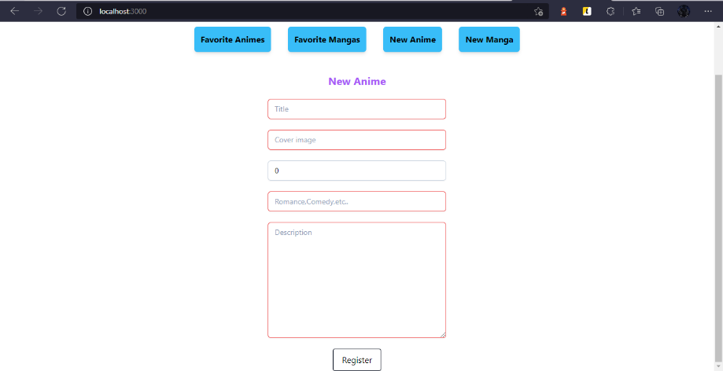

# Vue 3 + Typescript + Vite

This template should help get you started developing with Vue 3 and Typescript in Vite. The template uses Vue 3 `<script setup>` SFCs, check out the [script setup docs](https://v3.vuejs.org/api/sfc-script-setup.html#sfc-script-setup) to learn more.

para estilar este proyecto se utiliza [Tailwind](https://tailwindcss.com/) y para consumir el backend grapqhl se utiliza [villus](https://villus.logaretm.com/) el cual es mas ligero y rapido que el cliente apollo pero depende de sus preferencias.

## Capturas

Lista de animes 

Lista de Favoritos

Agregar nuevo Anime

